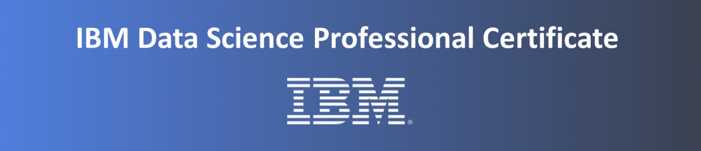
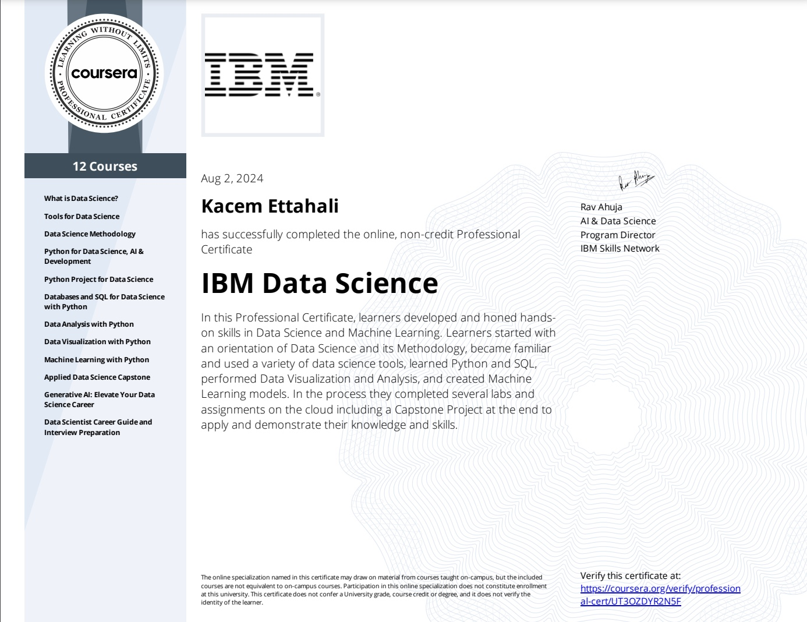

 
# About the IBM Data Science Professional Certificate Course
The [IBM Data Science Professional Certification](https://www.coursera.org/professional-certificates/ibm-data-science) consists of 12 online courses that provide the tools and skills to succeed in data science, including use of open source tools and libraries, Python, databases, SQL, data visualization, data analysis, statistical analysis, predictive modeling, and machine learning algorithms. Completion of the program awards professional with an employer-recognized certificate from IBM. 
# Summary of This Repository
This repository contains select course content, relevant notes, bits of code, final projects, quiz grades, and proof of certification for each course.  
**Additional Info:** *Please scroll down to view the employer-recognized Data Science Professional Certificate from IBM and verification link.* 
# Completed Courses and Certificates
- **Course 1:** [What is Data Science?]
- **Course 2:** [Tools for Data Science]
- **Course 3:** [Data Science Methodology]
- **Course 4:** [Python for Data Science, AI & Development]
- **Course 5:** [Python Project for Data Science]
- **Course 6:** [Databases and SQL for Data Science with Python]
- **Course 7:** [Data Analysis with Python]
- **Course 8:** [Data Visualization with Python]
- **Course 9:** [Maching Learning with Python]
- **Course 10:** [Applied Data Science Capstone]
- **Course 11:** [Generative AI: Elevate Your Data Science Career]
- **Course 12:** [Data Scientist Career Guide and Interview Preparation]
## IBM Skills Network: My Completed Final Projects
- ### Course 2: Tools for Data Science
  - Final Assignment: [*Data Science Tools and Ecosystem*]
- ### Course 3: Data Science Methodology
  - Final Assignment: [*Finding the Most Popular Email Providers During a 5-Day Work Week and Peer Reviews*]
- ### Course 5: Python Project for Data Science
  - Final Assignment: [*Extracting and Visualizing Stock Data*]
      - Graphs for Tesla: [*Extracting and Visualizing Stock Data*]
      - Graphs for GameStop: [*Extracting and Visualizing Stock Data*]
- ### Course 6: Databases and SQL for Data Science with Python
    - Final Assignment: [*Database Querying Using SQLite*]
      - School Data Used for Final: [*ChicagoPublicSchools.csv*]
      - Census Data Used for Final: [*ChicagoCensusData.csv*]
      - Crime Data Used for Final: [*ChicagoCrimeData.csv*]
- ### Course 7: Data Analysis with Python
    - Final Assignment: [Data Analytics for House Pricing Data Set]
    - Final Assignment: [Data Analytics for House Pricing Data Set: WITH GRAPHS]
      - Housing Price Data Used for Final: [housing.csv]
- ### Course 8: Data Visualization with Python
    - Final Assignment: [Part 1 - Create Visualizations Using Matplotlib, Seaborn & Folium]
    - Final Assignment: [Part 2 - Create Dashboard with Plotly and Dash]
## IBM Skills Network: My Completed Lab Projects
- ### Course 2: Tools for Data Science
    - Week 4: Hands-On Lab: [Getting Started with Jupyter Notebooks]
    - Week 4: Hands-On Lab: [Using Markdown in Jupyter Notebooks]
    - Week 4: Hands-On Lab: [Working with Files in Jupyter Notebooks]
        - Getting Started with Jupyter Notebooks: ([Updated for Use in this Lab])
    - Week 5: Hands-On Lab: [Getting Started with Github]
    - Week 5: Hands-On Lab: [Branching and Merging (Web UI)]
    - Week 6: Hands-On Lab: [Creating Your Jupyter Notebook]
- ### Course 3: Data Science Methodology
    - Week 2: Hands-On Lab: [From Understanding to Preparation]
    - Week 2: Hands-On Lab: [From Modeling to Evaluation]
- ### Course 4: Python for Data Science, AI & Development
    - Week 1: Hands-On Lab: [Your First Program, Types, Expressions, and Variables]
        - Your First Program, Types, Expressions and Variables ([Notes in Python])
    - Week 1: Hands-On Lab: [Strings]
        - Strings ([Notes in Python])
- ### Course 6: Databases and SQL for Data Science with Python
    - Week 5: Hands-On Lab: [Working with a Real World Dataset]
        - Dataset Used for Lab: [ChicagoPublicSchools.csv]
        - Report Card Data Used for Lab: [Chicago Public Schools Report Card Data (PDF)]
- ### Course 7: Data Analysis with Python
    - Week 1: Hands-On Lab: [Importing Datasets - Used Cars Pricing]
        - Car Pricing Used for Lab: [auto.csv]
    - Week 1: Hands-On Lab: [Importing Datasets - Laptop Pricing]
       - Laptop Pricing Used for Lab: [laptops.csv]
    - Week 2: Hands-On Lab: [Data Wrangling - Used Cars Pricing]
        - Car Pricing Used for Lab: [auto.csv]
    - Week 2: Hands-On Lab: [Data Wrangling - Laptop Pricing]
        - Laptop Pricing Used for Lab: [laptops.csv]
    - Week 3: Hands-On Lab: [Exploratory Data Analysis - Used Car Pricing]
        - Car Pricing Used for Lab: [usedcars.csv]
    - Week 3: Hands-On Lab: [Exploratory Data Analysis - Laptop Pricing]
        - Laptop Pricing Used for Lab: [laptops.csv]
    - Week 4: Hands-On Lab: [Model Development - Used Car Pricing]
        - Car Pricing Used for Lab: [usedcars.csv]
    - Week 4: Hands-On Lab: [Model Development - Laptop Pricing]
        - Laptop Pricing Used for Lab: [laptops.csv]
    - Week 5: Hands-On Lab: [Model Evaluation and Refinement - Used Car Pricing]
        - Car Pricing Used for Lab: [usedcars.csv]
    - Week 5: Hands-On Lab: [Model Evaluation and Refinement - Laptop Pricing]
        - Laptop Pricing Used for Lab: [laptops.csv]
- ### Course 8: Data Visualization with Python
    - Week 1: Hands-On Lab: [Exploring and Processing a Dataset Using Pandas]
    - Week 1: Hands-On Lab: [Introduction to Matplotlib and Line Plots]
    - Week 2: Hands-On Lab: [Area Plots, Histograms, and Bar Charts]
    - Week 2: Hands-On Lab: [Pie Charts, Box Plots, Scatter Plots, and Bubble Plots]
    - Week 2: Hands-On Lab: [Plotting Directly with Matplotlib]
    - Week 3: Hands-On Lab: [Waffle Charts, Word Clouds, and Regression Plots]
    - Week 3: Hands-On Lab: [Creating Maps and Visualizing Geospatial Data]
    - Week 4: Hands-On Lab: [Dash Basics: HTML and Core Components]
- ### Course 9: Machine Learning with Python
    - Week 2: Hands-On Lab: [Simple Linear Regression]
        - Vehicle Data Used for Lab: [FuelConsumption.csv]
    - Week 2: Hands-On Lab: [Multiple Linear Regression]
        - Vehicle Data Used for Lab: [FuelConsumption.csv]
    - Week 3:  Hands-On Lab: [KNN]
    - Week 3: Hands-On Lab: [Decision Trees]
    - Week 3: Hands-On Lab: [Faster Credit Card Fraud Detection Using Snap ML]
    - Week 3: Hands-On Lab: [Regression Trees]
    - Week 3: Hands-On Lab: [Faster Taxi Tip Prediction Using Snap ML]
    - Week 4: Hands-On Lab: [Logistic Regression]
    - Week 4: Hands-On Lab: [SVM (Support Vector Machines)]
    - Week 4: Hands-On Lab: [Multiclass Prediction]
    - Week 5: Hands-On Lab: [K-Means]
### Skills for Data Science 
The following skills are developed in this professional certificate program:
- Import and clean data sets
- Analyze and visualize data
- Build macine learning models and pipelines
- Develop knowledge of industry tools, languages, and libraries:
  - Methodology
  - RStudio
  - SQL
  - Data Mining
  - Jupyter Notebooks
### Tools for Data Science 
The following tools were used to complete this certification:
- Python
- Jupyter Notebook
- GitHub
- IBM Watson Studio
- IBM Cloud Pak 
### Python Libraries for Data Science 
The following Python libraries were used throughout the certification:
- Pandas
- Numpy
- SciPy
- matplotlib
- Seaborn
- plotly
- Folium
- scikit-learn 
# My Employer-Recognized Certificate from IBM:
Please [click here](https://coursera.org/verify/professional-cert/UT3OZDYR2N5F) to verify the certificate.  

